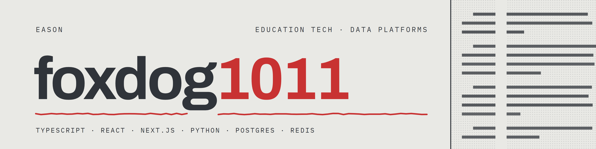

# Hi, I'm Eason

Full-stack developer with a Master's in Information Management from National Central University (NCU). I build AI-powered web applications with a focus on education technology and data-driven platforms.

---

## Tech Stack

---

## Featured Projects

### Stock Ledger

An independently built and operated Taiwan-equity decision system spanning
point-in-time market data, private portfolio analytics, sourced research,
production monitoring, and an autonomous publishing pipeline.

**[Engineering case study](https://foxdog1011.github.io/stock-ledger-showcase/)** ·
**[Production app](https://covenest.systems)** *(login required)* ·
**[YouTube output](https://www.youtube.com/channel/UC-TJSNbjSGP4c447hPjYLow)**

### IELTS AI Platform

A full-stack AI coaching platform for IELTS Writing and Speaking preparation. Features dual-engine scoring (GPT-4o + XGBoost), multi-agent study planning, FSRS spaced repetition, and gamification mechanics. Achieved MAE 0.570 on a 50-essay benchmark.

**Live demo:** [ielts-ai-platform-web.vercel.app](https://ielts-ai-platform-web.vercel.app)

### KeepInMind

Personal knowledge management and retention tool. More details coming soon.

---

## GitHub Stats

  
  

---

## Contact

- **LinkedIn:** [linkedin.com/in/foxdog1011](https://www.linkedin.com/in/foxdog1011)
- **GitHub:** [github.com/foxdog1011](https://github.com/foxdog1011)
