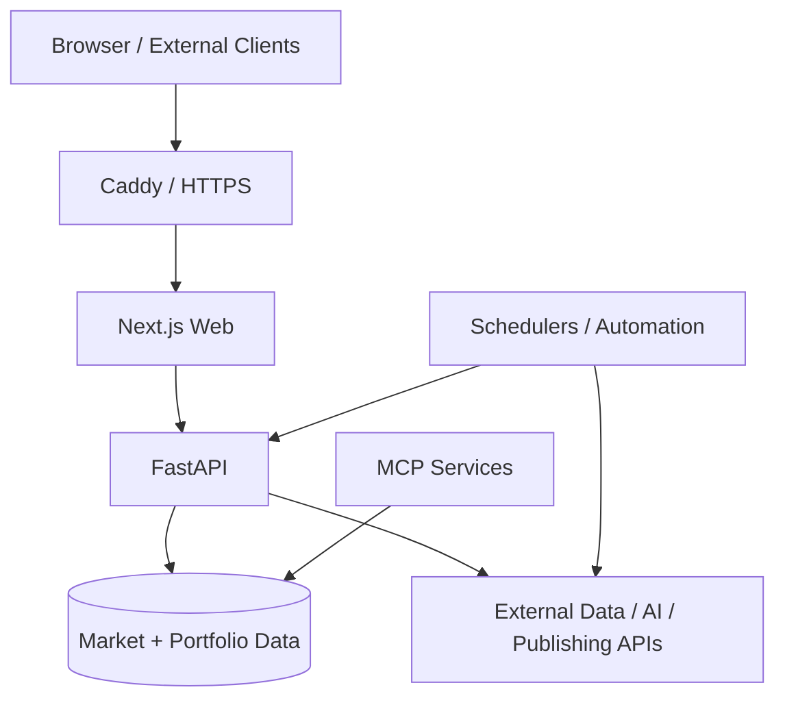

# Stock Ledger

> A production data, analytics, and automation platform for portfolio research, operational workflows, and AI-assisted analysis.

**Focus:** Production engineering · backend systems · infrastructure · automation · data pipelines

**Live:** https://stock-ledger-web.vercel.app/brief

---

## Overview

Stock Ledger started as a personal portfolio tracker and evolved into a continuously operated platform spanning data ingestion, portfolio analytics, scheduled automation, AI-assisted research, and content generation. The project is maintained as a production system rather than a local prototype, with explicit attention to deployment, observability, failure handling, network exposure, and recoverability.

The production source repository is private. This page summarizes the architecture, engineering decisions, and operational lessons behind the system.

---

## System Architecture

The system separates web, API, automation, and research interfaces so that each can evolve independently while sharing the same underlying portfolio and market data.

---

## Engineering Highlights

### Production Infrastructure

- Runs as a multi-service Docker deployment on Linux.
- Uses Caddy as the public HTTPS entry point and reverse proxy.
- Internal application services are bound to loopback instead of being directly exposed to the Internet.
- Operational configuration is version-controlled instead of being maintained only as ad-hoc server state.

### Data & Automation

- Scheduled jobs collect, transform, and analyze market data and trigger downstream workflows.
- The system supports portfolio analytics, research pipelines, AI-assisted analysis, and automated publishing.
- Data ownership is separated between shared market/research data and user-specific portfolio data.

### Reliability & Operations

- Automated health checks, backups, and failure notifications are part of the runtime design.
- Deployment and networking assumptions are tested rather than treated as configuration-only concerns.
- Operational documentation records the current runtime architecture and explicitly marks retired infrastructure.

---

## Engineering Case Studies

### 1. Docker Networking Exposure

**Problem**  
The host firewall showed only SSH and web ports as open, but internal Docker services were still reachable directly from the Internet.

**Root cause**  
Docker had inserted DNAT rules into its own iptables chain before the host firewall's normal INPUT path. Containers published on `0.0.0.0` therefore remained externally reachable even though the firewall configuration appeared restrictive.

**Fix**  
Published application ports were rebound to `127.0.0.1`, making Caddy the only public entry point.

**Prevention**  
A regression test was added to ensure internal containers cannot accidentally become Internet-facing again.

---

### 2. DNS and TLS Failure During Migration

**Problem**  
Certificate issuance failed during a DNS migration even though a public recursive resolver still returned the expected record.

**Diagnosis**  
The recursive resolver was serving cached data while the authoritative delegation had already changed. Certificate validation followed the authoritative path and therefore saw a different state.

**Fix**  
Deployment validation was changed to verify authoritative DNS directly before requesting certificates rather than relying only on cached recursive responses.

**Lesson**  
A successful recursive lookup is not sufficient evidence that a DNS migration has converged for systems that validate against authoritative DNS.

---

### 3. Turning Server State into Reproducible Operations

Some production configuration originally lived only under `/etc` on the VPS. That made changes difficult to audit and easy to lose during rebuilds.

The system now keeps operational configuration such as Caddy and SSH hardening files in version control and uses deployment scripts where practical. This reduces undocumented server drift and makes recovery more predictable.

---

## Product & Scale

A project audit on August 27, 2026 recorded:

| Metric | Result |
|---|---:|
| Published videos | 937 |
| Total views | 257,617 |
| Watch hours | 274.8 |
| Subscribers attributed | 202 |

The publishing pipeline turns structured market data and research signals into recurring content workflows, connecting backend automation with a user-facing output rather than stopping at data collection.

---

## Technical Decisions

### Why Docker Compose instead of Kubernetes?

The workload runs on a single host and benefits more from operational simplicity than from cluster orchestration. Compose keeps service boundaries explicit without adding control-plane overhead that the current scale does not require.

### Why Caddy as the external entry point?

Caddy provides a simple reverse-proxy layer with automatic HTTPS while allowing application services to remain isolated behind loopback bindings.

### Why keep application logic outside HTTP routers?

Core portfolio and analytics logic is designed to remain usable independently of the web layer. This makes it easier to test, reuse from CLI/MCP workflows, and evolve transport layers without coupling them to business rules.

### Why keep an authoritative runtime document?

The deployment architecture changed over time. Maintaining one explicit source of truth prevents stale infrastructure descriptions from being mistaken for the active production design.

---

## Tech Stack

**Languages:** Python, TypeScript, SQL  
**Backend:** FastAPI  
**Frontend:** Next.js  
**Infrastructure:** Docker, Linux, Caddy, HTTPS/TLS  
**Data:** SQLite, PostgreSQL / Supabase  
**Automation:** APScheduler, n8n  
**AI / Integration:** Claude, MCP, external market and publishing APIs

---

## Repository Note

This is a public technical case study. The production source code, credentials, and sensitive operational configuration remain in a private repository.
